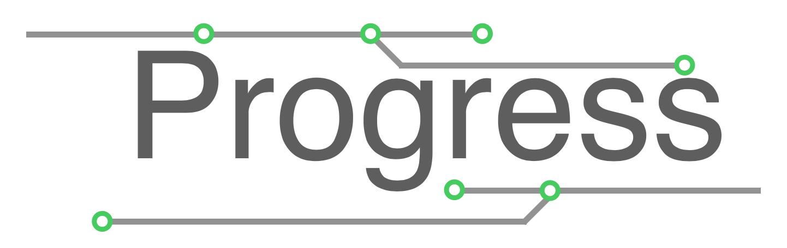

Hi there! I'll write progresses in summer vacation(55 days from 08/01 to 09/24).  

## Progress

### 08/01 sat

 - spent a lazy day

### 08/02 sun

 - coding App Extensions

### 08/03 mon

 - remote lesson(material mechanics, micro computer II, fourier analysys)
 - finish the assignment of *fourier analysys*
 - about *code "predict"*:
   - create slack workspace (and invite 301)
   - research about CAN network and circuit

### 08/04 tue

 - finish preparing of assignment *Electronic engineering*

### 08/05 wed

 - order *CAN interface* from Akizuki Denshi
 - finish report assignment *Probability and Statistics II*
 - headache

### 08/06 thu

 - finish report assignment *Electronic control engineering, Probability and Statistics II*
 - remote lesson(Electronic control engineering, Chinese)
 - ~care for some cosplay items~
 - found Python PDF Library: [PyPDF2](https://github.com/mstamy2/PyPDF2)
 
### 08/07 fri

 - about *code "predict"*:
   - discussion for specification decision
 - remote lesson(Electronics, Engineer ethics)
 - start report assingnment *Electronics*
 - ~CD~

### 08/08 sat

 - weeding
 - report assingnment *Electronics*
 
### 08/09 sun

 - finished report assingnment *Electronics* (spent a day for it 😠)

### 08/10 mon

 - finish exam *Probability and Statistics II*
 - create Pi case
 
### 08/11 tue

 - try io controlling of RPi
 - submit exam *Probability and Statistics II*
 - CAN network circuit (can't understand anything)
 
### 08/12 wed

 - submit report assignment *Electronics*
 - CAN network circuit (I understood everything perfectly 😎)
 - found fantastic CAN library (I wanna implement connection protocol using it)

### 08/13 thu

 - create CAN connection circuit module (can't understand anything)
 - write hex to AVR without arduinoIDE or Atmel Studio (I love AVR <3)
 
### 08/14 fri

 - start report assignment *Engineer ethics*
 - drifted the sea of web archives (~found old kig fans page~)
 
### 08/15 sat

 - make progress of assignments *enginner ethics*
 - can connection (CAN'T UNDERSTAND ALL OF WORLD)

### 08/16 sun

 - create portable ATmega328 board (use like Arduino UNO)
 - can connection (Okay, I understand a little part of CAN. connect with Pi is next step.)

### 08/17 mon

 - create connection between AVR and RPi
 - found can library for Python
